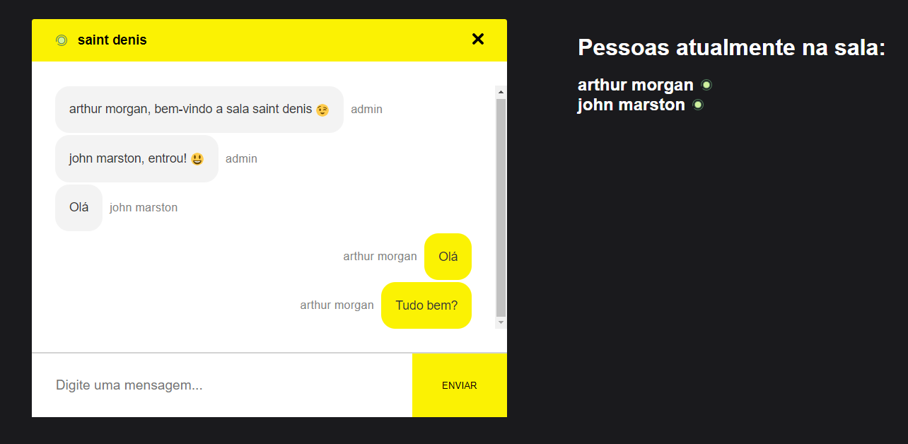

# Chat Online

Aplicativo Web de chat online.

## Tecnologias

Tecnologias usadas no projeto.

* React
* Node.js
* Socket.io

## Serviços Usados

* Github
* Flaticon
  
## Começando

* Dependências

  * Git
  * NPM
  * Yarn

* Para rodar o projeto:

> $ yarn start

## Créditos

Icons made by <a href="https://www.flaticon.com/authors/freepik" title="Freepik">Freepik</a> from <a href="https://www.flaticon.com/" title="Flaticon"> www.flaticon.com</a>
